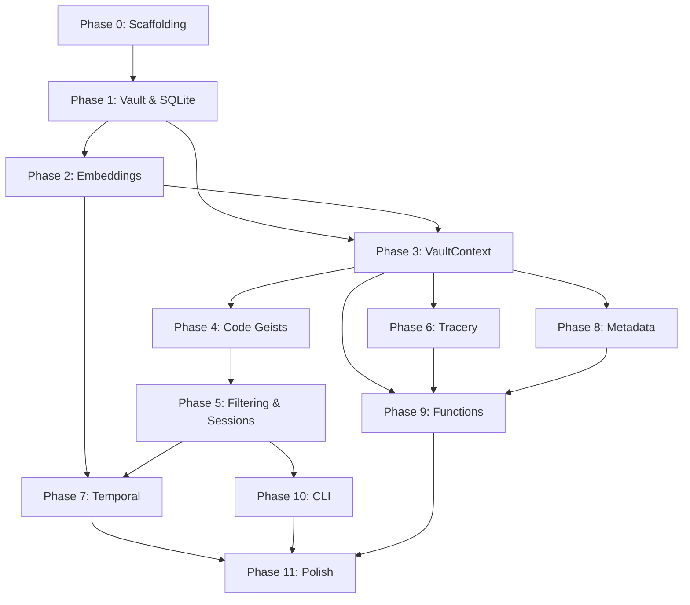

# GeistFabrik Implementation Phases

This document outlines the implementation roadmap for GeistFabrik. Each phase builds on the previous, delivering working functionality that can be verified programmatically.

**For detailed acceptance criteria**, see [acceptance_criteria.md](acceptance_criteria.md).

---

## Phase Overview

| Phase | Focus | Duration Estimate | Dependencies | Core AC | Edge AC | Total AC |
|-------|-------|-------------------|--------------|---------|---------|----------|
| 0 | Project scaffolding | 1 day | None | 7 | 7 | 14 |
| 1 | Vault parsing & SQLite | 3-5 days | Phase 0 | 7 | 13 | 20 |
| 2 | Basic embeddings | 2-3 days | Phase 1 | 5 | 10 | 15 |
| 3 | VaultContext & queries | 3-4 days | Phase 2 | 5 | 10 | 15 |
| 4 | Code geist execution | 2-3 days | Phase 3 | 6 | 14 | 20 |
| 5 | Filtering & session notes | 3-4 days | Phase 4 | 6 | 14 | 20 |
| 6 | Tracery integration | 3-4 days | Phase 3 | 6 | 14 | 20 |
| 7 | Temporal embeddings | 3-4 days | Phase 2, 5 | 5 | 13 | 18 |
| 8 | Metadata extensibility | 2-3 days | Phase 3 | 5 | 14 | 19 |
| 9 | Function extensibility | 2-3 days | Phase 3, 6, 8 | 5 | 14 | 19 |
| 10 | CLI & invocation modes | 2-3 days | Phase 5 | 8 | 18 | 26 |
| 11 | Polish & optimisation | 3-5 days | All | 8 | 17 | 25 |
| **Total** | | **6-8 weeks** | | **73** | **158** | **231** |

---

## Phase 0: Project Scaffolding

**Goal**: Set up Python project structure, dependencies, and basic test infrastructure.

### Deliverables
- Python package structure with uv
- `pyproject.toml` with dependencies
- pytest configuration
- CI/CD pipeline (GitHub Actions)
- **Phase completion checker script** (`scripts/check_phase_completion.py`)
- Development documentation
- Git repository with proper ignores

### Key Technologies
- uv for dependency management
- pytest for testing
- ruff for linting
- mypy for type checking
- GitHub Actions for CI/CD

### Acceptance Criteria
See [acceptance_criteria.md](acceptance_criteria.md#phase-0-project-scaffolding) - **14 criteria total**
- 7 core criteria (structure, dependencies, tests, linting, CI, phase completion checker)
- 7 edge case criteria (uv config, Python version, dev deps, git setup, etc.)

### Test Coverage Target
- N/A (no implementation code yet)

### Exit Criteria
- All Phase 0 ACs pass
- `uv run pytest` runs without errors (even with no tests)
- Linting and type checking configured
- uv environment fully functional
- CI pipeline green
- Phase completion checker functional and reports Phase 0 status

---

## Phase 1: Vault Parsing & SQLite Persistence

**Goal**: Parse Obsidian markdown files and store in SQLite database.

### Deliverables
- `Vault` class with file parsing
- SQLite schema creation
- Incremental sync logic
- Note, Link, Tag extraction
- Markdown parser with full Obsidian syntax support
- Graph relationship tracking

### Key Technologies
- SQLite with sqlite-vec extension
- Python markdown parsing
- File watching for incremental sync

### Acceptance Criteria
See [acceptance_criteria.md](acceptance_criteria.md#phase-1-vault-parsing--sqlite-persistence) - **20 criteria total**
- 7 core criteria (unit tests, kepano vault loading, database schema, sync, graph)
- 13 edge case criteria (broken markdown, empty vault, large files, UTF-8, circular links, etc.)

### Test Coverage Target
- `src/geistfabrik/vault.py`: >90%
- `src/geistfabrik/markdown_parser.py`: >90%
- `src/geistfabrik/persistence.py`: >85%

### Exit Criteria
- All Phase 1 ACs pass
- Kepano vault loads completely
- Database contains all notes, links, tags
- Incremental sync demonstrably faster
- Edge cases handled gracefully

---

## Phase 2: Basic Embeddings

**Goal**: Compute and store semantic embeddings using sentence-transformers.

### Deliverables
- Embedding computation using all-MiniLM-L6-v2
- sqlite-vec integration
- Embedding storage and retrieval
- Vector similarity search
- Embedding cache management

### Key Technologies
- sentence-transformers (all-MiniLM-L6-v2 model)
- sqlite-vec for vector storage
- NumPy for vector operations

### Acceptance Criteria
See [acceptance_criteria.md](acceptance_criteria.md#phase-2-basic-embeddings) - **15 criteria total**
- 5 core criteria (embedding tests, computation, dimensions, similarity, performance)
- 10 edge case criteria (empty content, long notes, model failures, memory limits, etc.)

### Test Coverage Target
- `src/geistfabrik/embeddings.py`: >85%

### Exit Criteria
- All Phase 2 ACs pass
- Embeddings stored in SQLite via sqlite-vec
- Semantic search returns sensible results
- Model loads once and caches
- Performance targets met

---

## Phase 3: VaultContext & Query Operations

**Goal**: Build rich context layer with graph operations and metadata access.

### Deliverables
- `VaultContext` class
- Semantic search methods
- Graph query methods (orphans, hubs, unlinked_pairs)
- Temporal query methods
- Deterministic sampling
- Metadata access layer

### Key Technologies
- SQLite queries for graph operations
- Random number seeding for determinism
- Caching layer for performance

### Acceptance Criteria
See [acceptance_criteria.md](acceptance_criteria.md#phase-3-vaultcontext--query-operations) - **15 criteria total**
- 5 core criteria (context tests, semantic search, graph ops, sampling, temporal queries)
- 10 edge case criteria (empty vault, single note, cycles, disconnected graphs, etc.)

### Test Coverage Target
- `src/geistfabrik/vault_context.py`: >90%

### Exit Criteria
- All Phase 3 ACs pass
- VaultContext provides all query methods
- Deterministic sampling verified
- Kepano vault queries work end-to-end
- Edge cases handled gracefully

---

## Phase 4: Code Geist Execution

**Goal**: Load and execute Python-based geists with timeout and error handling.

### Deliverables
- Geist loader for `.py` files
- `suggest(vault: VaultContext)` interface
- Timeout execution (5 seconds)
- Failure tracking and auto-disable
- Test command logging
- Geist isolation mechanisms

### Key Technologies
- Python importlib for dynamic loading
- Signal-based timeout mechanism
- Exception handling and logging

### Acceptance Criteria
See [acceptance_criteria.md](acceptance_criteria.md#phase-4-code-geist-execution) - **20 criteria total**
- 6 core criteria (executor tests, loading, execution, timeout, failure tracking, integration)
- 14 edge case criteria (syntax errors, invalid returns, readonly enforcement, isolation, etc.)

### Test Coverage Target
- `src/geistfabrik/geist_executor.py`: >85%

### Exit Criteria
- All Phase 4 ACs pass
- Sample geists execute successfully
- Timeout mechanism verified
- Error handling robust
- Geist isolation working

---

## Phase 5: Filtering & Session Notes

**Goal**: Filter suggestions and write session journal notes.

### Deliverables
- Filtering pipeline (boundary, novelty, diversity, quality)
- Session management
- Journal note writer
- Block ID generation
- Duplicate prevention
- Session history tracking

### Key Technologies
- SQLite for history tracking
- Embedding similarity for diversity filtering
- Markdown generation for journal notes

### Acceptance Criteria
See [acceptance_criteria.md](acceptance_criteria.md#phase-5-filtering--session-notes) - **20 criteria total**
- 6 core criteria (filtering tests, session tests, note writing, formatting, multi-day)
- 14 edge case criteria (overwrite protection, permissions, malicious content, date handling, etc.)

### Test Coverage Target
- `src/geistfabrik/filtering.py`: >85%
- `src/geistfabrik/session.py`: >85%
- `src/geistfabrik/journal_writer.py`: >90%

### Exit Criteria
- All Phase 5 ACs pass
- Session notes written correctly
- Filtering removes duplicates and low-quality
- Block IDs unique and stable
- Edge cases handled gracefully

---

## Phase 6: Tracery Integration

**Goal**: Support Tracery-based geists with vault function calls.

### Deliverables
- Tracery YAML parser
- Grammar expansion engine
- `$vault.*` function bridge
- Deterministic expansion
- Recursion limit enforcement
- Grammar validation

### Key Technologies
- YAML parsing (PyYAML)
- Tracery grammar library
- Function registry integration

### Acceptance Criteria
See [acceptance_criteria.md](acceptance_criteria.md#phase-6-tracery-integration) - **20 criteria total**
- 6 core criteria (tracery tests, parsing, expansion, vault functions, determinism, integration)
- 14 edge case criteria (invalid YAML, infinite recursion, missing functions, unicode, etc.)

### Test Coverage Target
- `src/geistfabrik/tracery.py`: >85%

### Exit Criteria
- All Phase 6 ACs pass
- Tracery geists execute and generate suggestions
- Vault functions callable from grammars
- Expansion deterministic
- Edge cases handled gracefully

---

## Phase 7: Temporal Embeddings

**Goal**: Compute session-specific embeddings with temporal features.

### Deliverables
- Session embedding computation
- Temporal features (age, season)
- Multi-session storage
- Drift detection utilities
- Session comparison API
- Temporal geists support

### Key Technologies
- 387-dimensional embeddings (384 semantic + 3 temporal)
- Session-based storage
- Time-series analysis utilities

### Acceptance Criteria
See [acceptance_criteria.md](acceptance_criteria.md#phase-7-temporal-embeddings) - **18 criteria total**
- 5 core criteria (temporal tests, session embeddings, features, multi-session, temporal geists)
- 13 edge case criteria (duplicate sessions, future dates, season calculation, pruning, etc.)

### Test Coverage Target
- `src/geistfabrik/temporal_embeddings.py`: >85%

### Exit Criteria
- All Phase 7 ACs pass
- Session embeddings include temporal features
- Multiple sessions can be stored and compared
- Drift detection utilities work
- Temporal geists functional

---

## Phase 8: Metadata Extensibility

**Goal**: Support user-defined metadata inference modules.

### Deliverables
- Metadata module loader
- `infer(note, vault) -> Dict` interface
- Conflict detection
- Built-in metadata modules (complexity, temporal, etc.)
- Metadata caching system
- Module validation

### Key Technologies
- Dynamic module loading
- JSON serialization for metadata storage
- Validation framework

### Acceptance Criteria
See [acceptance_criteria.md](acceptance_criteria.md#phase-8-metadata-extensibility) - **19 criteria total**
- 5 core criteria (metadata tests, loading, inference, conflict detection, E2E)
- 14 edge case criteria (syntax errors, invalid returns, timeouts, persistence, etc.)

### Test Coverage Target
- `src/geistfabrik/metadata_system.py`: >85%

### Exit Criteria
- All Phase 8 ACs pass
- Metadata modules loadable from directory
- Conflict detection prevents key collisions
- Metadata accessible via VaultContext
- Edge cases handled gracefully

---

## Phase 9: Function Extensibility

**Goal**: Support user-defined vault functions for Tracery.

### Deliverables
- Function registry
- `@vault_function` decorator
- Built-in vault functions
- Tracery bridge (`$vault.*`)
- Function discovery system
- Function validation

### Key Technologies
- Decorator pattern
- Function registration system
- Tracery integration

### Acceptance Criteria
See [acceptance_criteria.md](acceptance_criteria.md#phase-9-function-extensibility) - **19 criteria total**
- 5 core criteria (registry tests, registration, calling from Python/Tracery, built-ins)
- 14 edge case criteria (syntax errors, invalid signatures, timeouts, readonly enforcement, etc.)

### Test Coverage Target
- `src/geistfabrik/function_registry.py`: >85%

### Exit Criteria
- All Phase 9 ACs pass
- Functions discoverable and callable
- Tracery can invoke functions
- Built-in functions implemented
- Edge cases handled gracefully

---

## Phase 10: CLI & Invocation Modes

**Goal**: Command-line interface with multiple invocation modes.

### Deliverables
- `geistfabrik` CLI entry point
- `invoke` command with modes
- `test` command for geist development
- Configuration file loading
- Help system
- Error reporting

### Key Technologies
- Click or argparse for CLI
- YAML for configuration
- Rich for output formatting

### Acceptance Criteria
See [acceptance_criteria.md](acceptance_criteria.md#phase-10-cli--invocation-modes) - **26 criteria total**
- 8 core criteria (CLI tests, installation, invocation modes, config loading)
- 18 edge case criteria (invalid paths, concurrent access, unicode handling, exit codes, etc.)

### Test Coverage Target
- `src/geistfabrik/cli.py`: >85%

### Exit Criteria
- All Phase 10 ACs pass
- CLI commands work as specified
- Config file properly loaded
- All invocation modes functional
- Excellent error messages

---

## Phase 11: Polish & Optimisation

**Goal**: Performance optimisation, documentation, and production readiness.

### Deliverables
- Performance benchmarks met
- Complete user documentation
- Example geists (20+ shipped)
- Error messages improved
- Logging system
- Migration guides
- Troubleshooting documentation
- Platform-specific testing

### Key Technologies
- mkdocs for documentation
- pytest-benchmark for performance
- bandit for security scanning

### Acceptance Criteria
See [acceptance_criteria.md](acceptance_criteria.md#phase-11-polish--optimisation) - **25 criteria total**
- 8 core criteria (performance, coverage, E2E, docs, examples, linting, security)
- 17 additional criteria (migration, compatibility, platform tests, load testing, etc.)

### Test Coverage Target
- Overall project: >85%
- Critical paths: >95%

### Exit Criteria
- All Phase 11 ACs pass
- Documentation complete
- Performance targets met
- Ready for public release

---

## Cross-Phase Continuous Criteria

These must remain true throughout all phases:

```bash
# All existing tests continue to pass
uv run pytest tests/unit/ tests/integration/ -v

# Code quality maintained
uv run ruff check src/
uv run mypy src/ --strict

# Test coverage doesn't decrease
uv run pytest --cov=geistfabrik --cov-report=term --cov-fail-under=85

# CI/CD pipeline green (runs automatically on push)
```

---

## Dependencies Between Phases



**Critical Path**: P0 → P1 → P2 → P3 → P4 → P5 → P10 → P11

**Parallel Work Opportunities**:
- P6 (Tracery) can be developed alongside P4-P5
- P8 (Metadata) and P9 (Functions) can be developed in parallel
- P7 (Temporal) can be developed after P2, parallel to P8-P9

---

## Recommended Development Order

### For a Single Developer

1. **Week 1**: P0, P1 (Foundation)
2. **Week 2**: P2, P3 (Intelligence layer)
3. **Week 3**: P4, P5 (Core functionality)
4. **Week 4**: P6, P8 (Extensibility basics)
5. **Week 5**: P9, P7 (Advanced features)
6. **Week 6**: P10, P11 (Polish & release)

### For a Team of 3

- **Developer A**: P0 → P1 → P2 → P7
- **Developer B**: P0 → P3 → P4 → P5 → P10
- **Developer C**: P0 → P6 → P8 → P9
- **All**: P11 (polish together)

---

## Automation & CI/CD

### GitHub Actions Workflow

Create `.github/workflows/phase-checks.yml`:

```yaml
name: Phase Acceptance Criteria

on: [push, pull_request]

jobs:
  phase-checks:
    runs-on: ubuntu-latest
    steps:
      - uses: actions/checkout@v3
      - uses: astral-sh/setup-uv@v1

      - name: Install dependencies
        run: uv sync

      - name: Check which phases are complete
        run: uv run python scripts/check_phase_completion.py

      - name: Run tests for completed phases
        run: uv run pytest -v --cov=geistfabrik

      - name: Performance benchmarks
        if: github.event_name == 'push' && github.ref == 'refs/heads/main'
        run: uv run pytest tests/performance/ --benchmark-only

      - name: Upload coverage
        uses: codecov/codecov-action@v3
```

### Phase Completion Checker

Create `scripts/check_phase_completion.py`:

```python
"""
Automatically verify which implementation phases are complete.
"""

import subprocess
import sys
import os
from pathlib import Path

PHASES = {
    0: [
        "test -d src/geistfabrik",
        "test -f pyproject.toml",
        "uv run pytest --collect-only",
    ],
    1: [
        "uv run pytest tests/unit/test_vault.py -v",
        "uv run pytest tests/unit/test_markdown_parser.py -v",
        "uv run pytest tests/integration/test_kepano_vault.py::test_load_kepano_vault -v",
    ],
    2: [
        "uv run pytest tests/unit/test_embeddings.py -v",
        "uv run pytest tests/integration/test_kepano_vault.py::test_kepano_embeddings -v",
    ],
    # ... etc for all phases
}

def check_phase(phase_num: int, checks: list[str]) -> bool:
    """Run all checks for a phase, return True if all pass."""
    print(f"\n🔍 Checking Phase {phase_num}...")

    for check in checks:
        try:
            result = subprocess.run(
                check,
                shell=True,
                capture_output=True,
                timeout=30
            )
            if result.returncode != 0:
                print(f"  ❌ Failed: {check}")
                return False
        except Exception as e:
            print(f"  ❌ Error: {check} - {e}")
            return False

    print(f"  ✅ Phase {phase_num} complete!")
    return True

def main():
    completed_phases = []

    for phase_num, checks in sorted(PHASES.items()):
        if check_phase(phase_num, checks):
            completed_phases.append(phase_num)
        else:
            # Stop at first incomplete phase
            break

    print(f"\n📊 Completed Phases: {completed_phases}")
    print(f"🎯 Next Phase: {max(completed_phases) + 1 if completed_phases else 0}")

    # Write status for GitHub Actions
    output_file = os.getenv('GITHUB_OUTPUT', '/dev/null')
    with open(output_file, 'a') as f:
        f.write(f"completed_phases={','.join(map(str, completed_phases))}\n")
        f.write(f"next_phase={max(completed_phases) + 1 if completed_phases else 0}\n")

if __name__ == "__main__":
    main()
```

---

## Phase Transition Checklist

Before marking a phase complete:

- [ ] All AC checks for the phase pass
- [ ] All tests for the phase pass
- [ ] Code coverage meets target
- [ ] Documentation updated
- [ ] CHANGELOG.md entry added
- [ ] Git tag created (e.g., `phase-3-complete`)
- [ ] Phase demo recorded (optional but recommended)
- [ ] Retrospective notes captured
- [ ] acceptance_criteria.md updated with status

---

## Success Metrics Dashboard

Create `scripts/metrics.sh`:

```bash
#!/bin/bash

echo "GeistFabrik Implementation Progress"
echo "===================================="
echo ""

# Phases completed
uv run python scripts/check_phase_completion.py

# Test metrics
echo ""
echo "Test Metrics:"
uv run pytest --collect-only | grep "test session starts"
uv run pytest --cov=geistfabrik --cov-report=term | grep "TOTAL"

# Code quality
echo ""
echo "Code Quality:"
uv run ruff check src/ --statistics
uv run mypy src/ --strict | grep "Success"

# Performance (if implemented)
if [ -d "tests/performance" ]; then
    echo ""
    echo "Performance:"
    uv run pytest tests/performance/ --benchmark-only --benchmark-columns=min,max,mean
fi
```

---

## Key Benefits of This Phasing

1. **Each phase delivers working, testable functionality**
2. **Progress is objectively measurable via automated tests**
3. **Integration issues are caught early**
4. **The project can be "paused" at any phase with working software**
5. **Parallel development is possible for teams**
6. **Acceptance criteria document tracks progress independently**

---

**For detailed acceptance criteria and status tracking**, see [acceptance_criteria.md](acceptance_criteria.md).
